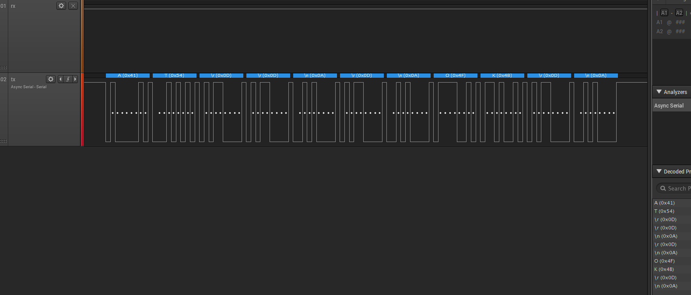

# ESP8266 Embedded programming
### PINOUT

### Billeder af TX aktivitet
- TX transmission / recieve
    - 
        - På billedet kan man se at kommandoen "**AT**" er levet sendt. Hvor svaret så har været "**OK**" med carrige return og new line