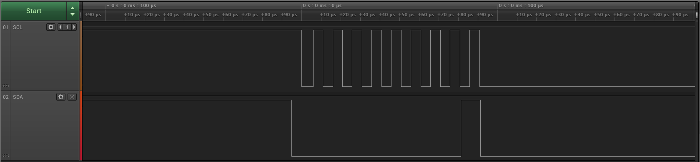

# I2C Programming
### Topologi
- SCL er sat til VCC (5V) men går først gennem en 10K modtand
- SDA er sat til vcc (5v) men går først gennem en 10K modstand

### Billede af output

- Se billede med navn **I2C-Start.jpg** i billede mappen
    - Dette billede vider

